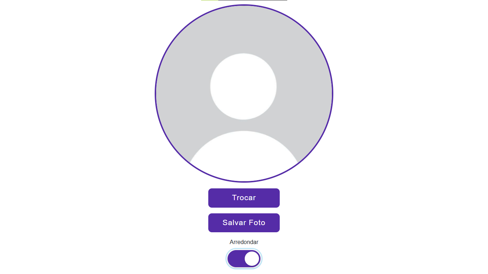
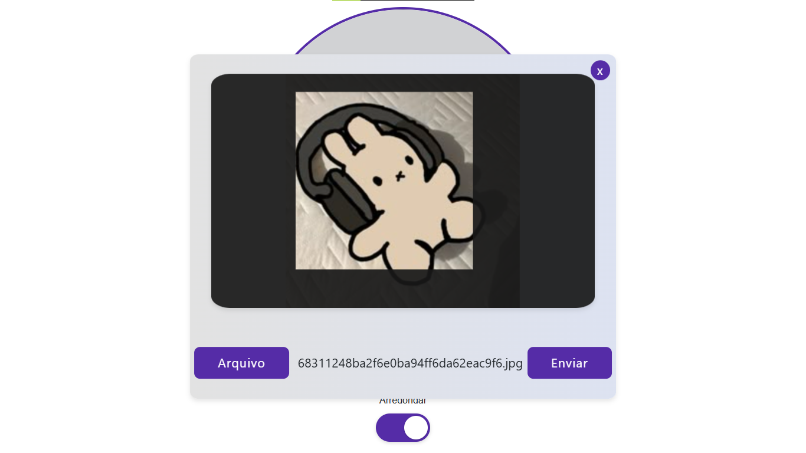
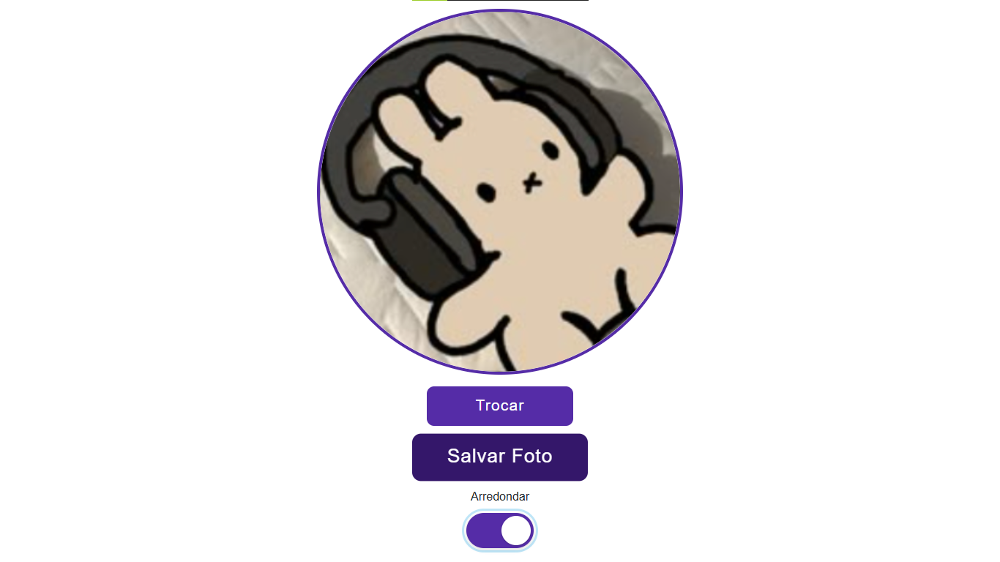

# Pfp-cut

**Projeto:** Pfp-cut  
**Autor:** Jhonatan | Nathan  
**GitHub:** [https://github.com/Ntzzn-Dev](https://github.com/Ntzzn-Dev)  
**Data:** 25/09/2025  

 

## Descrição  

Este projeto é uma aplicação web simples que permite ao usuário carregar imagens do computador, realizar o corte personalizado em um canvas e exportar a foto resultante em formato PNG.

## Principais funcionalidades:

- Upload de imagens locais (.png, .jpg, .jpeg).

- Corte da imagem no canvas com máscara redonda.

- Corte da imagem no canvas com máscara quadrada.

- Exportação da imagem já recortada em Base64/PNG.

- Pré-visualização imediata do resultado.

## Demonstração

### Tela Principal  
Na tela principal, você tem a opção de arredondar, tanto o corte quanto a exibição da imagem, salvar imagem que esta em exibição, ou trocar a imagem.  

### Tela de corte   
Na tela de corte você tem a opção de buscar uma imagem local, direcionar o corte usando o mouse, redimensionar usando o scroll e finalmente efetuar o corte.  

### Salvar imagem cortada  
Assim que cortada a imagem fica em exibição pronta para o download.    

