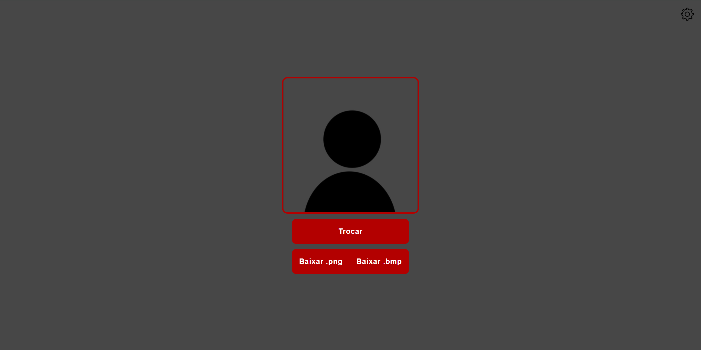

# Pfp-cut

**Projeto:** Pfp-cut  
**Autor:** Jhonatan | Nathan  
**GitHub:** https://github.com/Ntzzn-Dev  
**Data de criação:** 25/09/2025  
**Última atualização:** 18/07/2026


> Aplicação web desenvolvida em HTML, CSS e JavaScript para criação e
> exportação de fotos de perfil com recorte interativo utilizando HTML5
> Canvas.  

------------------------------------------------------------------------

## Descrição

O **Pfp-cut** é uma ferramenta web leve, desenvolvida sem frameworks,
que permite carregar imagens locais, posicionar e redimensionar uma área
de recorte interativa e exportar o resultado em **PNG** ou **BMP**.

O projeto foi criado para explorar recursos nativos do navegador,
incluindo manipulação de imagens, Canvas API, FileReader API e geração
manual de arquivos BMP.

------------------------------------------------------------------------

## Funcionalidades

-   ✅ Upload de imagens (.png, .jpg, .jpeg)
-   ✅ Área de recorte interativa
-   ✅ Arrastar com o mouse
-   ✅ Zoom utilizando scroll
-   ✅ Zoom utilizando slider
-   ✅ Máscara quadrada
-   ✅ Máscara circular
-   ✅ Pré-visualização em tempo real
-   ✅ Exportação em PNG
-   ✅ Exportação em BMP
-   ✅ Exportação em Base64

------------------------------------------------------------------------

## Tecnologias

-   HTML5
-   CSS3
-   JavaScript (ES6)
-   HTML5 Canvas API

------------------------------------------------------------------------

## Recursos Técnicos

-   Manipulação de imagens através da **FileReader API**
-   Renderização utilizando **Canvas API**
-   Conversão manual de Canvas para BMP
-   Exportação em Base64
-   Eventos de mouse e teclado
-   Manipulação dinâmica do DOM

------------------------------------------------------------------------

## Executando o projeto

Clone o repositório:

``` bash
git clone https://github.com/Ntzzn-Dev/Pfp-cut.git
```

Abra o arquivo `index.html`

------------------------------------------------------------------------

## Como utilizar

1.  Clique em **Trocar imagem**.
2.  Selecione uma imagem do computador.
3.  Posicione o recorte com o mouse.
4.  Ajuste o tamanho usando o scroll ou slider.
5.  Escolha entre recorte quadrado ou circular.
6.  Clique em **Enviar**.
7.  Salve em PNG ou BMP.

------------------------------------------------------------------------

## Demonstração

### Tela principal

<p float="left">

</p>

### Tela de recorte
<p float="left">

</p>

### Resultado

<p float="left">

</p>

------------------------------------------------------------------------

## Desafios

Durante o desenvolvimento foram implementadas soluções sem bibliotecas
externas, como:

-   Conversão de Canvas para BMP.
-   Sistema próprio de recorte.
-   Máscara circular utilizando clipping.
-   Exportação em Base64.
-   Sincronização entre preview e imagem exportada.

------------------------------------------------------------------------

## Roadmap

-   [ ] Rotacionar imagens
-   [ ] Espelhamento horizontal/vertical
-   [ ] Suporte completo para dispositivos móveis

------------------------------------------------------------------------

## Changelog

Veja o changelog completo em [CHANGELOG.md](CHANGELOG.md)
